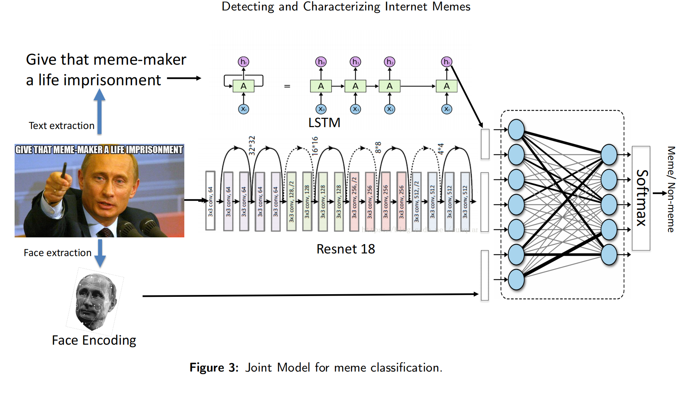

# Understanding Political Memes 
###### _The Last Markdown Editor, Shiqi Yang_

### Problem Statement:
Among all social media platforms, using memes to express emotions implicitly and humorously, and to communicate feelings has become a trend. However, combining humor with cultural relevance, Internet memes have become a ubiquitous artifact of the digital age and have special characteristics compared to general image. Therefore, it is difficult for machines to understand and analyze memes on the Internet. In this research, we are going to focus on Political Memes especially concerning Mexico’s presidential election and try to build up a multi-Deep learning model for detecting, clustering and understanding Political Memes. 

### Data:

- Images from platforms including Twitter, Facebook, Youtube, Instagram searched by key words concerning Mexico’s presidential election.

### Methods:
##### Meme Detection
- Dubey, Moro, Cebrian and Rahwan (2018). https://arxiv.org/abs/1802.04936
- Memespector(Python) https://github.com/amintz/memespector-python (need fee)

##### Meme Optical Character Recognition:Extracting text in memes
- easyocr (slow)
- Google Vision API (need fee)

##### Human Face Encoding
As faces are an important element of memes, we extract facial features using the open source
face detection software package called "face\_recognition", created by Adam Geitgey and made available at    https://github.com/ageitgey/face_recognition.

### Framework:

### Credits

DM Beskow, S Kumar, KM Carley
https://www.sciencedirect.com/science/article/abs/pii/S0306457319307988
